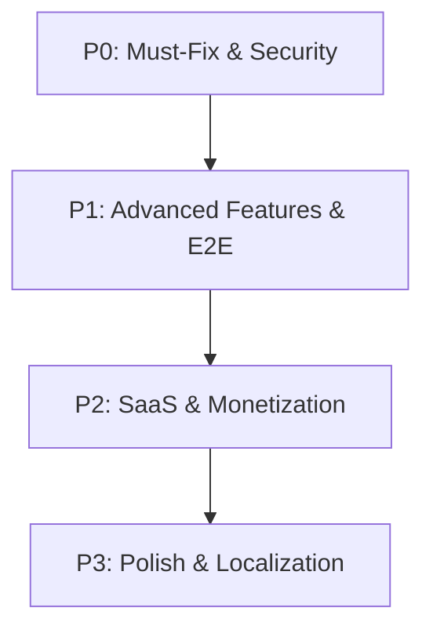

# AI Job Copilot — Advanced Real Product Roadmap

This document outlines the engineering priorities, estimated efforts, provider dependencies, security considerations, and exact implementation sequence for the next phases of **AI Job Copilot**.

---

## 🗺️ Roadmap Priority Matrix

---

## 🔴 P0: Release Hardening & Security (Sprint 1-2)

These items are blocker-level requirements before opening the application to public production traffic.

### 1. P0-1: Private Storage Migration (S3/R2)
* **Goal**: Move resume and PDF files from public local directory `/uploads` to private cloud storage.
* **Problem**: Storing files on disk on Render is ephemeral. Files are lost on every redeploy. Furthermore, public `/uploads` allows unauthorized guessing of user resumes.
* **Solution**: Activate the private storage service. Generate presigned URLs (15-minute TTL) for all file reads and downloads.
* **Effort**: Medium (2 days)
* **Provider Dependency**: AWS S3 or Cloudflare R2
* **Security Risk**: Public bucket ACL leak (Mitigated by blocking all public permissions).
* **Implementation Order**: 1

### 2. P0-2: Google OAuth Handoff Hardening
* **Goal**: Replace query parameter access token transport with HttpOnly cookies.
* **Problem**: Deployed Google OAuth callback passes the raw JWT access token back via `/login?googleToken=...`. This leaks tokens in browser logs and URL histories.
* **Solution**: Backend sets a secure HttpOnly cookie upon callback validation and redirects clean to `/dashboard`.
* **Effort**: Medium (1.5 days)
* **Provider Dependency**: Google OAuth
* **Security Risk**: XSS session hijacking.
* **Implementation Order**: 2

### 3. P0-3: Remove Default Metric placeholders
* **Goal**: Display accurate data states instead of default numbers in the signed-in cockpit.
* **Problem**: The analytics dashboard shows a hardcoded average ATS score of `82` and false weekly applications when the database is empty.
* **Solution**: Render blank/empty states with educational prompts to prompt actions.
* **Effort**: Small (0.5 days)
* **Provider Dependency**: None
* **Security Risk**: None
* **Implementation Order**: 3

### 4. P0-4: Missing Route Aliases
* **Goal**: Support standard URLs requested by the browser.
* **Problem**: `/tracker`, `/career-operating-system`, `/interview-prep`, and `/skill-roadmap` return 404 pages.
* **Solution**: Add Next.js NextConfig redirects or pages aliasing to `/applications`, `/dashboard`, `/interviews`, and `/skill-gap` respectively.
* **Effort**: Small (0.5 days)
* **Provider Dependency**: None
* **Security Risk**: None
* **Implementation Order**: 4

### 5. P0-5: GitHub Analyzer Backend Mounting
* **Goal**: Connect frontend analyzer tool to backend route.
* **Problem**: The frontend project analyzer page calls `/api/ai/github-analyzer`, but the backend route is missing.
* **Solution**: Implement the missing backend AI route using the provider-ready GitHub client interface.
* **Effort**: Small (1 day)
* **Provider Dependency**: GitHub API (via `GITHUB_TOKEN`)
* **Security Risk**: API key rate limits.
* **Implementation Order**: 5

---

## 🟡 P1: Advanced Core Features (Sprint 3)

These features enhance the user experience, providing high-value tools to job seekers.

### 6. P1-1: Multi-Format Resume Exporter
* **Goal**: Support high-quality PDF and DOCX downloads.
* **Problem**: The UI offers a DOCX option but backend only compiles PDFs.
* **Solution**: Integrate a word-processing layout engine (e.g. `docx` library) to export standard editable Word files.
* **Effort**: Medium (3 days)
* **Provider Dependency**: None
* **Security Risk**: File injection.
* **Implementation Order**: 6

### 7. P1-2: Chrome Extension URL Job Import
* **Goal**: Parse active job details from web boards with a single click.
* **Problem**: Manual copy-pasting is slow.
* **Solution**: Sync active credentials with the Chrome extension and call a scraper-ready parser on the active tab's HTML context.
* **Effort**: Large (4 days)
* **Provider Dependency**: Chrome Web Store Host permissions
* **Security Risk**: CORS bypass.
* **Implementation Order**: 7

### 8. P1-3: STAR Answer Builder & AI Voice Coach
* **Goal**: Structure interview answers using the STAR method (Situation, Task, Action, Result) with verbal responses.
* **Problem**: Mock interview is text-only, not mirroring real interview formats.
* **Solution**: Integrate Speech-to-Text browser APIs to record audio, parse transcription text, and let the AI grade speaking speed and relevance.
* **Effort**: Large (5 days)
* **Provider Dependency**: OpenAI/Gemini AI API
* **Security Risk**: Storage of audio transcripts.
* **Implementation Order**: 8

---

## blue P2: SaaS & Commercial Upgrades (Sprint 4)

Monetization capabilities and recruiter-facing portals.

### 9. P2-1: Stripe Billing & Plan Enforcements
* **Goal**: Limit free tier capabilities and collect payments.
* **Problem**: All users have infinite resume uploads and AI usage limits.
* **Solution**: Restrict free accounts (e.g., 2 resumes, 3 AI kits per month). Integrate Stripe Checkout redirects and webhook listeners.
* **Effort**: Medium (3 days)
* **Provider Dependency**: Stripe Developer Console
* **Security Risk**: Webhook signature verification bypass (Mitigated via strict header validation).
* **Implementation Order**: 9

### 10. P2-2: Custom Domain Portfolio Hosting
* **Goal**: Allow users to share portfolios on custom urls.
* **Problem**: Portfolios are restricted to the same domain: `/u/[slug]`.
* **Solution**: Integrate wildcard domain routing on the Vercel DNS setup.
* **Effort**: Medium (2.5 days)
* **Provider Dependency**: Vercel DNS API
* **Security Risk**: Subdomain takeover.
* **Implementation Order**: 10

---

## 🟢 P3: Polish & Localization (Sprint 5)

Richer global compatibility and stability controls.

### 11. P3-1: Hinglish/Hindi AI Prompt Support
* **Goal**: Support multilingual Indian job-seekers.
* **Problem**: AI models only communicate in English.
* **Solution**: Upgrade the prompt templates to accept input context in Hindi/Hinglish and output responses in matching hybrid tones.
* **Effort**: Small (2 days)
* **Provider Dependency**: OpenAI/Gemini AI
* **Security Risk**: None
* **Implementation Order**: 11

### 12. P3-2: Sentry Error Alerting
* **Goal**: Capture crashes and trace performance lag automatically.
* **Problem**: Unhandled exceptions only print to backend terminal logs.
* **Solution**: Initialize the Sentry SDK client-side and server-side, configuring alerts.
* **Effort**: Small (1.5 days)
* **Provider Dependency**: Sentry Developer Console
* **Security Risk**: PII leakage in crash dumps (Mitigated by scrubbing emails and tokens before reporting).
* **Implementation Order**: 12
