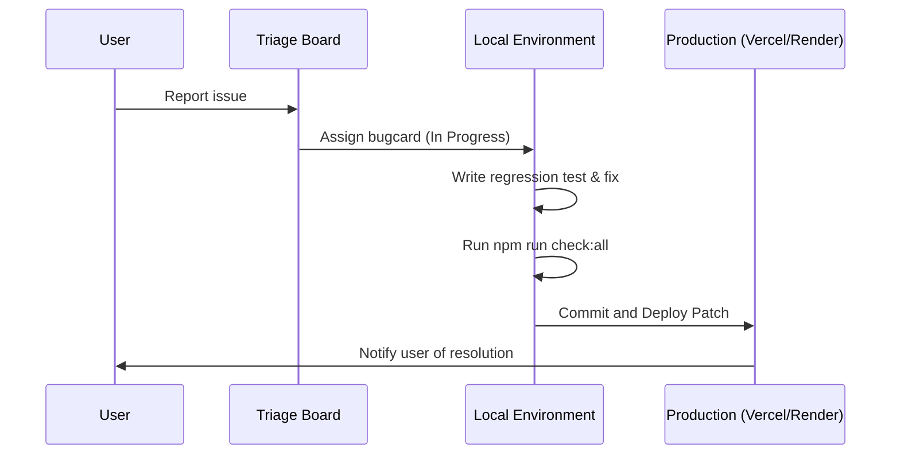

# Beta Feedback Next Actions

## ⚠️ Pre-Launch Status
- **Current Feedback Status:** **No real beta feedback collected yet.** The platform is fully prepared for launch, and the next step is recruiting the first cohort of testers.

---

## 🚀 Onboarding Strategy (First 5–10 Testers)

1. **Identify Target Testers:**
   - Select 5–10 active job-seeking developers from your network.
   - Select 1–2 tech recruiters or hiring managers to validate the recruiter dashboard portal.
2. **Send Personalized Invitations:**
   - Use the outreach templates in the [Beta Tester Invite Kit](beta-tester-invite-kit.md).
   - Log their names and contact details in the [Outreach Tracker](beta-tester-outreach-list-template.md).
3. **Provide Guide and Scripts:**
   - Share the [Beta Tester Guide](beta-tester-guide.md) to explain the platform's core goals.
   - Point them to the [Beta Test Scripts](beta-test-scripts.md) to run through structured scenarios.

---

## 💬 Exact Manual Messages to Send

### Message 1: Direct LinkedIn/WhatsApp Invite (Job Seeker Dev)
> "Hi **{First Name}**! Hope you're doing well. I've just launched the public beta for **AI Job Copilot** (https://ai-job-copilot-frontend.vercel.app) — it's a career operating cockpit I built for developers. It parses resumes, calculates ATS scores, tailors cover letters, and has a built-in recruiter CRM and Kanban board.
> 
> Since you're currently exploring new roles, I'd love to get your feedback. Could you try signing up, uploading your resume, and tracking a test application? Let me know if you run into any bugs or weird layout issues. Thanks so much!"

### Message 2: Direct LinkedIn/WhatsApp Invite (Hiring Manager/Recruiter)
> "Hey **{First Name}**! I've put together a prototype for a developer-focused career CRM called **AI Job Copilot** (https://ai-job-copilot-frontend.vercel.app). 
> 
> Along with applicant-side tools, we've designed a dedicated Recruiter Portal (accessible at `/recruiters`) to help companies identify top verified candidates without dealing with spam. I'd value your input on our candidate privacy model and what features you'd want in a recruiter dashboard. Let me know what you think!"

### Message 3: Email Invite (Warm Contact)
> **Subject:** Quick favor: AI Job Copilot Beta Onboarding
> 
> Hi **{First Name}**,
> 
> I hope you're having a great week!
> 
> I'm preparing to launch **AI Job Copilot v2**, a privacy-first career cockpit and CRM tracker for developers. 
> 
> Before opening it up broadly, I'm inviting 5–10 select builders to test it out. I would love for you to be one of them.
> 
> You can try the live app here:
> 👉 https://ai-job-copilot-frontend.vercel.app
> 
> We have set up a quick 10-minute walkthrough script here to guide you:
> 👉 https://github.com/Yogesh-Dubey18/AI-JOB-COPILOT/blob/main/docs/beta-test-scripts.md
> 
> You can submit any feedback or bugs via the in-app `/feedback` button or directly by replying to this email.
> 
> Thanks a lot for your support!
> 
> Best regards,  
> Yogesh

---

## 📥 Feedback Capture and Intake

When feedback is received via email, Discord, direct messaging, or the in-app `/feedback` page:
1. **Log the Issue:** Create a new entry card in the [Feedback Triage Board](beta-feedback-triage-board.md).
2. **Assign Severity:**
   - **Critical (P0):** Blockers for signup, resume upload, or core AI parsing.
   - **High (P1):** Core feature failing with no workaround.
   - **Medium (P2):** UX friction or minor feature bugs.
   - **Low (P3):** Styling issues, spelling errors, or feature requests.

---

## 🔄 Bugfix and Patch Release Loop

Follow this loop to resolve bugs and deploy patches safely:



### Steps:
1. **Local Setup & Replication:**
   - Replicate the reported bug in your local dev environment.
   - If the bug is related to a specific resume file, get permission to test using the redacted version.
2. **Develop the Fix:**
   - Apply the fix in the frontend or backend code.
   - Do not delete existing tests; write new unit tests if applicable.
3. **Safety Verification:**
   - Before committing any code change, run the full validation suite:
     ```powershell
     npm run check:git-safety
     npm run check:security
     npm run check:docs
     npm run build
     npm test
     ```
4. **Deploy & Notify:**
   - Push to `main` to trigger the automated CI/CD pipeline to Vercel/Render.
   - Once live, verify on the staging environment.
   - Reply to the user using the response templates in the [Support Playbook](support-and-feedback-playbook.md).
