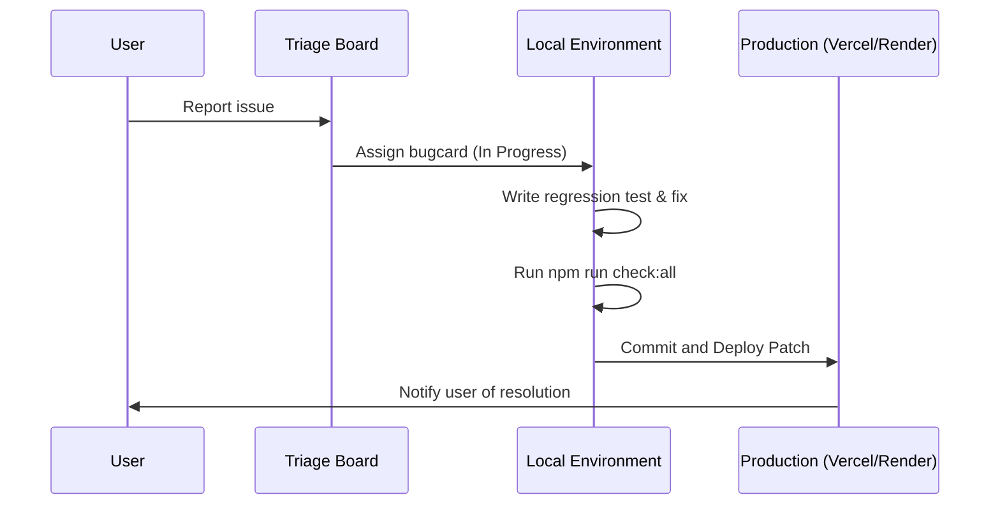

# Beta Feedback Next Actions

This document establishes the operational strategy to onboard the first cohort of beta testers, collect and triage initial feedback, and run the hotfix/patch deployment cycle.

---

## 🚀 Onboarding Strategy (First 5–10 Testers)

1. **Identify Target Testers:**
   - Select 5–10 active job-seeking developers from your network.
   - Select 1–2 tech recruiters or hiring managers to validate the recruiter dashboard portal.
2. **Send Personalized Invitations:**
   - Use the outreach templates in the [Beta Tester Invite Kit](beta-tester-invite-kit.md).
   - Log their names and contact details in the [Outreach Tracker](beta-tester-outreach-list-template.md).
3. **Provide Guide and Scripts:**
   - Share the [Beta Tester Guide](beta-tester-guide.md) to explain the platform's core goals.
   - Point them to the [Beta Test Scripts](beta-test-scripts.md) to run through structured scenarios.

---

## 📥 Feedback Capture and Intake

When feedback is received via email, Discord, direct messaging, or the in-app `/feedback` page:
1. **Log the Issue:** Create a new entry card in the [Feedback Triage Board](beta-feedback-triage-board.md).
2. **Assign Severity:**
   - **Critical (P0):** Blockers for signup, resume upload, or core AI parsing.
   - **High (P1):** Core feature failing with no workaround.
   - **Medium (P2):** UX friction or minor feature bugs.
   - **Low (P3):** Styling issues, spelling errors, or feature requests.

---

## 🔄 Bugfix and Patch Release Loop

Follow this loop to resolve bugs and deploy patches safely:



### Steps:
1. **Local Setup & Replication:**
   - Replicate the reported bug in your local dev environment.
   - If the bug is related to a specific resume file, get permission to test using the redacted version.
2. **Develop the Fix:**
   - Apply the fix in the frontend or backend code.
   - Do not delete existing tests; write new unit tests if applicable.
3. **Safety Verification:**
   - Before committing any code change, run the full validation suite:
     ```powershell
     npm run check:git-safety
     npm run check:security
     npm run check:docs
     npm run build
     npm test
     ```
4. **Deploy & Notify:**
   - Push to `main` to trigger the automated CI/CD pipeline to Vercel/Render.
   - Once live, verify on the staging environment.
   - Reply to the user using the response templates in the [Support Playbook](support-and-feedback-playbook.md).
