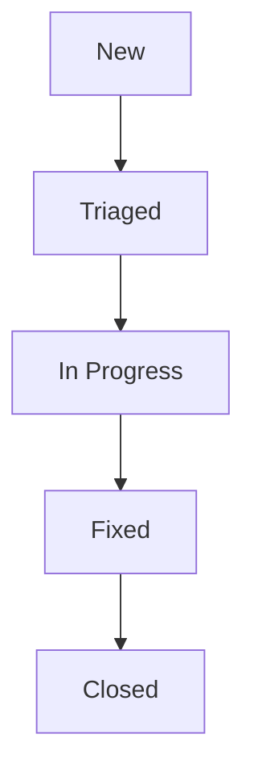

# Beta Feedback Triage Board

Use this board to track and prioritize feedback, bug reports, and feature requests submitted by beta testers.

---

## 📋 Triage Board

| ID | Description | Category | Severity | Reported By | Status | Target Release | Notes / Action Items |
|---|---|---|---|---|---|---|---|
| BF-001 | Resume parser fails on multi-column PDF layouts | Bug | High | Jane Smith (ID 002) | New | v2.0.1-beta | Check pdf-parse fallback libraries. |
| BF-002 | Mobile navigation burger icon overlaps user avatar | UI/UX | Medium | Alex Rivera (ID 003)| Triaged | v2.0.1-beta | Adjust CSS padding in header component. |
| BF-003 | Add support for exporting cover letters directly to Docx | Feature | Low | John Doe (ID 001) | Triaged | v2.1.0-stable | Queue behind PDF export stability. |
| BF-004 | DB Connection Timeout under concurrent mock interviews | Perf | Critical | Auto-Sentry | In Progress | v2.0.1-beta | Optimize Mongo indexing on Interview model. |
| BF-005 | Email notification toggle switches reset on page refresh | Bug | Medium | Priya Sharma (ID 004)| Fixed | v2.0.1-beta | Solved in commit `9c8e1a7` (LocalStorage caching).|

---

## 🛠️ Status Definitions

- **New:** Feedback has been received but not yet reviewed.
- **Triaged:** Reviewed and classified. Assigned severity and target release version.
- **In Progress:** Developer actively working on a fix/implementation.
- **Fixed:** Change has been merged and verified on staging.
- **Closed:** Tester verified the fix in the live app, or it is confirmed resolved.

---

## 🚦 Severity Guidelines
- **Critical:** Platform crashes, data loss, login/register blockers, or security/privacy vulnerability. (Target fix: < 24 hours).
- **High:** Core feature (Resume Parse, Apply Assistant, Tracker) is broken with no workaround. (Target fix: < 48 hours).
- **Medium:** Minor feature broken, or layout/UX is confusing but user can complete task. (Target fix: Weekly patch).
- **Low:** Cosmetic issues, spelling errors, or feature requests. (Target fix: Next minor release).
