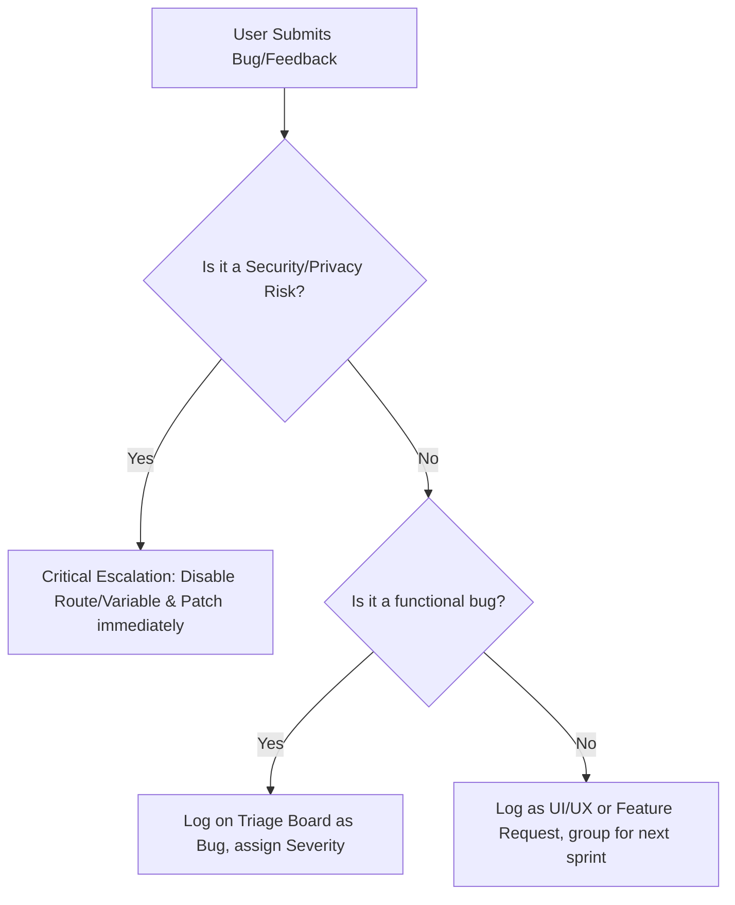

# Support and Feedback Playbook

This playbook defines operational procedures for managing user issues, responding to bug reports, and handling communication during the **AI Job Copilot v2 Beta**.

---

## 🛠️ Step-by-Step Intake and Handling Flow

---

## 💬 Standard Response Templates

### Template 1: Standard Bug Acknowledgment
> **Subject:** Re: [AI Job Copilot Beta] Issue with [Feature Name]
>
> Hi **{Name}**,
>
> Thank you for participating in the AI Job Copilot v2 Beta! We've received your report regarding the issue with **{Feature Name}**.
>
> I have logged this on our feedback tracking board: [beta-feedback-triage-board.md](beta-feedback-triage-board.md) under ID **{ID}**. I am looking into it and will update you as soon as a patch is deployed to production.
>
> Best regards,  
> Yogesh

### Template 2: General Feature Request Response
> **Subject:** Re: [AI Job Copilot Beta] Feedback on [Feature Idea]
>
> Hi **{Name}**,
>
> Thanks for the suggestion to add **{Feature Idea}** to the platform!
>
> This sounds like a great enhancement. I have added it to our feature backlog for prioritization. Since we are currently focusing on stabilization and bug fixing during the v2 beta, we will review feature suggestions in detail before planning the next major release.
>
> You can track our roadmap and release status directly on GitHub:  
> 👉 https://github.com/Yogesh-Dubey18/AI-JOB-COPILOT
>
> Thanks again for helping make AI Job Copilot better!
>
> Best,  
> Yogesh

---

## 🚨 Common Scenarios & Quick Fix Reference

1. **Scenario: Parser fails with "Unsupported format" or extracts gibberish**
   - **Root Cause:** Next.js parsing library error or corrupted PDF encoding.
   - **Resolution:** Advise the tester to export their resume directly from Google Docs or Word as a clean PDF without advanced graphics. Log the file structure on the triage board to test with local pdf parser scripts.
2. **Scenario: User receives "Auth service unavailable" notice**
   - **Root Cause:** Deployed Render backend is sleeping (spin-up delay can take 50+ seconds on free tiers).
   - **Resolution:** Ask the user to refresh after 60 seconds. Mention this is due to free-tier hosting limits.
3. **Scenario: AI outputs mock data**
   - **Root Cause:** OpenAI/Gemini API key is not configured or has hit billing limits on the backend.
   - **Resolution:** Verify API keys in Render dashboard env settings.
